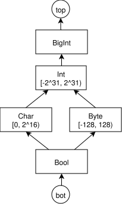

# Задания с лекций

## Lect 2
### Что будет, если в нашу систему ввести тип Bool?

Новые правила:
$$
\begin{array}{c|c}
\texttt{False} & [[ \texttt{False} ]] = \text{bool} \\
\texttt{True} & [[ \texttt{True} ]] = \text{bool} \\
\end{array}
$$

Изменённые правила:
$$
\begin{array}{c|c}
E_1 == E_2 & [[ E_1 ]] = [[ E_2 ]],\quad [[ E_1 == E_2 ]] = \text{bool} \\
E_1 < E_2 & [[ E_1 ]] = [[ E_2 ]] = \text{int},\quad [[ E_1 < E_2 ]] = \text{bool} \\
\texttt{if}\ (E)\ S & [[ E ]] = \text{bool} \\
\texttt{while}\ (E)\ S & [[ E ]] = \text{bool} \\
\end{array}
$$

С введением булевого типа типовой анализ станет менее точным из-за отсутствии арифметики над Bool.
Корректная программа, которая не типизируется с добавлением Bool:
```
main() {
    var a, b, c;
    a = 1 == 2;
    b = 2 == 2;
    c = a + b;
    return c;
}
```

При этом полнота осталась неизменной, т.к.
* с одной стороны очевидно, что множество принимаемых программ не увеличилось
* с другой, если программа корректна и типизируется без Bool, то 0/1 внутри условий можно привести к false/true.
  А значит программа типизируется и с Bool.

### Что будет, если в нашу систему ввести тип Array?
Вводим тип $\text{arr}(T)$ для массивов с элементами типа $T$.

Новые правила:
$$
\begin{array}{c|c}
\{\} & [[ \{\} ]] = \text{arr}(T')\ (T' - fresh type) \\
\{E_1, \ldots, E_n\} & [[ E_1 ]] = \cdots = [[ E_n ]],\quad [[ \{E_1,\ldots,E_n\} ]] = \text{arr}([[ E_1 ]]) \\
E_1[E_2] = E_3 & [[ E_1 ]] = \text{arr}([[ E_3 ]]),\quad [[ E_2 ]] = \text{int} \\
E_1[E_2] & \text{arr}([[ E_1[E_2] ]]) = [[ E_1 ]],\quad [[ E_2 ]] = \text{int} \\
\end{array}
$$

Вывод типов для указанной в задании программы:

```
main() {
    var x,y,z,t;
    x = {2,4,8,16,32,64}; \\ [[x]] = arr(int)
    y = x[x[3]];          \\ [[y]] = int
    z = {{},x};           \\ [[z]] = arr(arr(int))
    t = z[1];             \\ [[t]] = arr(int)
    t[2] = y;
}
```

## Lect 3
### $\top$ и $\bot$ (14 слайд)

> Являются ли они точной верхней или нижней гранью какого-либо подмножества $S$?

$\bot$ является набольшей нижней гранью множества состоящего только из самого себя.
Аналогично с и $\top$.

> Уникальны ли они?

От обратного: пусть есть два максимальных $\phi$ и $\psi$ ($\phi \neq \psi$).
Пусть $\omega = \sup\{\phi, \psi\}$. По определению $\sup$: $\phi \sqsubseteq \omega$.
По максимальности $\phi$: $\omega \sqsubseteq \phi$,
Из антисимметричности оба факта дают $\phi = \omega$. Аналогичное рассуждение можно провести для $\psi$ и $\omega$.
В результате $\psi = \phi = \omega$, противоречие.

### Произведение решёток (16 слайд)

> Как выглядит $\sqcup L_1 \times L_2 \times \ldots \times L_n$?

Возьмём $a = (a_1,\ldots,a_n) \in L$ и $b = (b_1,\ldots,b_n) \in L$.
Проверим, что $a \sqcup b = (a_1 \sqcup_1 b_1,\; \ldots,\; a_n \sqcup_n b_n)$.

$a \sqcup b$ -- какая-то верхняя грань, так как $\forall i, (a_i \sqsubseteq_i a_i \sqcup_i b_i) \land (b_i \sqsubseteq_i a_i \sqcup_i b_i)$.

Проверим, что данная грань точная.
Пусть $d = (d_1,\ldots,d_n) \in L$ — произвольная верхняя грань.
По опр. $d$: $a \sqsubseteq d \land b \sqsubseteq d$.
Раскрывая по определению произведения решёток:
$\forall i,\; a_i \sqsubseteq_i d_i$ и $\forall i, b_i \sqsubseteq_i d_i$.
Откуда следует $a_i \sqcup_i b_i \sqsubseteq_i d_i$.
Поскольку это выполняется для всех $i$, получаем $a \sqcup b \sqsubseteq d$.

> Какая высота у произведения решеток $L_1 \times L_2 \times \ldots \times L_n$?
Обозначим за $h(L_i)$ -- высоту решётки.

Тогда проверим, что
$h(L_1 \times \cdots \times L_n) = h(L_1) + \cdots + h(L_n)$.

С одной стороны мы можем взять $n$ цепей из каждой из решеток и построить общую цепь, изменяя максимум по одной компоненте вдоль цепи за раз.
Такая цепь будет иметь длину $h(L_1) + \cdots + h(L_n)$.


Допустим существует цепь длины $k > h(L_1) + \cdots + h(L_n)$.
Тогда на этом пути хотя бы в одной компоненте (пусть это будет $i$) количество различных элементов пути больше $h(L_i)$.
Это вызывает противоречие с определением $h(L_i)$, т.к. мы нашли путь в решётке $L_i$ длиннее её высоты.

### Решетка отображений (18 слайд)

> Как выглядят верхние и нижние грани для решётки отображний?

$\sqcup$ и $\sqcap$ вычисляются поточечно:

$$
(f \sqcup g)(x) = f(x) \sqcup_L g(x), \qquad (f \sqcap g)(x) = f(x) \sqcap_L g(x).
$$

Проверка аналогична произведению: $(f \sqcup g)$ является верхней гранью, так как $\forall x:\; f(x) \sqsubseteq_L f(x) \sqcup_L g(x)$ и $g(x) \sqsubseteq_L f(x) \sqcup_L g(x)$.
Если $h$ — другая верхняя грань ($f \sqsubseteq h$ и $g \sqsubseteq h$), то $\forall x:\; f(x) \sqsubseteq_L h(x)$ и $g(x) \sqsubseteq_L h(x)$, откуда $f(x) \sqcup_L g(x) \sqsubseteq_L h(x)$, т.е. $f \sqcup g \sqsubseteq h$.

> Какова высота решётки отображний?

$$
h(A \to L) = |A| \cdot h(L)
$$

Аналогично произведению, можем построить цепь, поднимая значения вдоль цепи в каждой точке, потому не меньше.
По каждой из точек изменений не больше высоты решетки, поэтому в точности.

### Можно ли выразить анализ типов с предыдущей лекции как анализ над решетками? (41 слайд)
> Если да, то как выглядит наша решетка?
Для расмотренной в прошлой лекции системы типов
можно взять плоскую решетку, дополненную $\top$ и $\bot$.
Все уравнения из прошлой лекции можно выразить в виде системы ограничений для монотонного фреймворка.

### Анализ над решетками как анализ типов? (41 слайд)
> Можно ли выразить анализ над решетками как анализ типов?
В простых случаях можно (рассказано на лекции).

Рассмотренный на прошлой лекции анализ типов не локален, а значит
потокочувствительные анализы, которые выразимы в монотонном фреймворке, не будут
выразимы в виде такового анализа типов.

## Lect 5
### Решётка для анализа размера переменных
> Предложите решетку для реализации анализа размера
переменных



Для получения целевого анализа необходимо использовать решетку отображений из CFG в
представленную выше решетку размеров. В таком случае будет получен flow-sensitive may анализ.

> Опишите правила вычисления различных выражений

Пусть $shift([l, r])$ -- функция, возвращающая минимальный размер из решётке выше, содержащая весь интервал.

* Все константные вычисляем в наименьший размер, который его содержит
$$
eval(\sigma,k) = shift([k, k])
$$
* Всю арифметику предлагается сделать следующим образом.
  Воспользуемся интервальным анализом над уже известными размерами, получим некоторый числовой интервал.
  Результатом вычисления является наименьший размер, содержащий весь интервал.
$$
eval(\sigma,E_1\,op\,E_2) =
  shift(eval(\sigma, E_1)\,\overline{op}\,eval(\sigma, E_2))
$$

$$
eval(\sigma, \mathtt{input}) = \texttt{any}
$$

> Придумайте нетривиальный пример программы на TIP для
получившегося анализа и посмотрите, что для него получается

Пример может быть найден в файле `./examples/varsizes.tip`

### Lect 6
> Напишите вариант программы, для которой анализ
открытости-закрытости файлов не показывает корректный
результат даже с учётом всех возможных условий в переходах

Привер корректной программы, где анализ из лекции ложно сработает проблему.
```
01. x = input;
02. y = input;
03. if (x + y > 0) {
04.     open()
05. } else {
06.     x = x + 1;
07.     y = y - 1;
08. }
09. if (x + y > 0) {
10.     close()
11. }
```
При описанном в лекции потокочувствительном анализе данной программы будет
использоваться решётка отображений из $\{x + y > 0, x + y \le 0\}$ в решётку состояний открытости/закрытости файла.

В строке 06 отображение из любого значения предиката ведёт в $\{close\}$, что при join с другой веткой условия
приводит к тому, что перед девятой строкой $\{x + y > 0\} \mapsto \{open, close\}$, что вызовет
ложный вердикт при анализе строки 10.

> Предложите, каким образом можно решить описанные в лекции
проблемы в этой ситуации

Можно вообще не думая расширить решетку до решётки отображений из интервалов значений x + y
(в общем случае у нас будет решетка отображений из всех интервалов числовых значений, которые используются в предикате).

Есть подозрение, что данный подход будет очень медленным, и описанная на лекции идея CEGAR кажется более гибкой
и перспективной для подобного анализа.

### Lect 8
> Напишите вариант программы, для которой
контекстно-чувствительный анализ знаков требует коэффициент
$k > 1$

```
f(x) {
    return x;
}

ff(y) {
    return f(y);
}

main() {
    var a, b;
    a = ff(1);
    b = ff(2);
    return a + b;
}
```

При $k = 1$ оба вызова $f$ будут иметь одинаковый контекст,
а значит значение $x$ будет заджоинено в $\top$.

> Приведите пример решётки, для которой
контекстно-чувствительный анализ в функциональном стиле
является более ресурсозатратным, чем
контекстно-чувствительный анализ по месту вызова с глубиной 2

Пусть $m$ -- количество вызовов, а $n$ -- число анализируемых переменных.
Если взять решетку из анализа времени жизни переменных, состоящую из множества
всех подмножеств переменных, тогда контекстно-чувствительный анализ по месту вызова с глубиной 2
будет иметь сложность $O(m^2 \cdot 2^n)$,
в то время как анализ в функциональном стиле -- $O(4^n)$.
